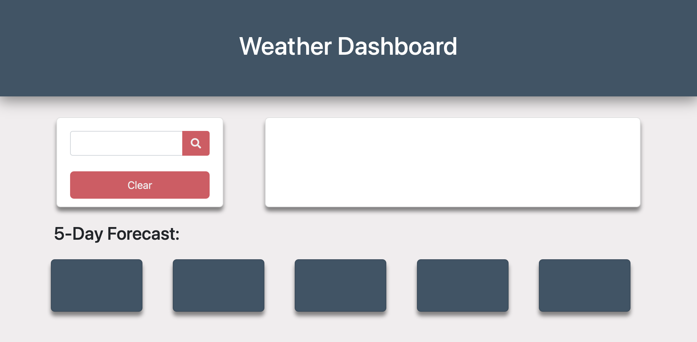
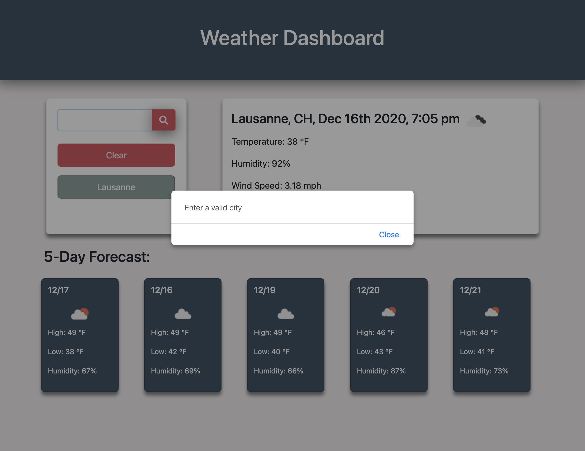
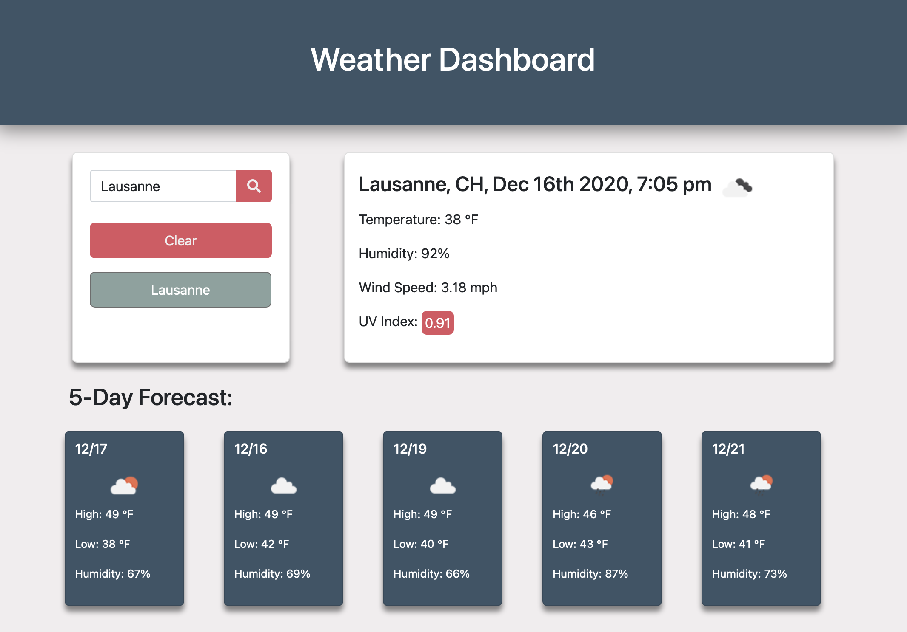
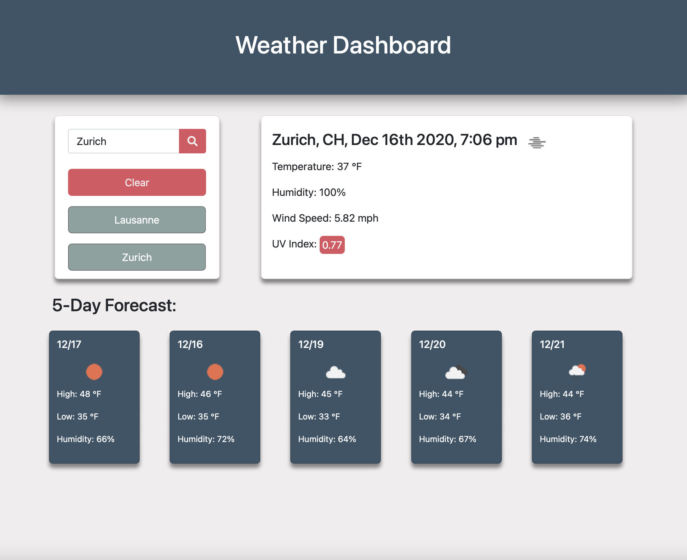
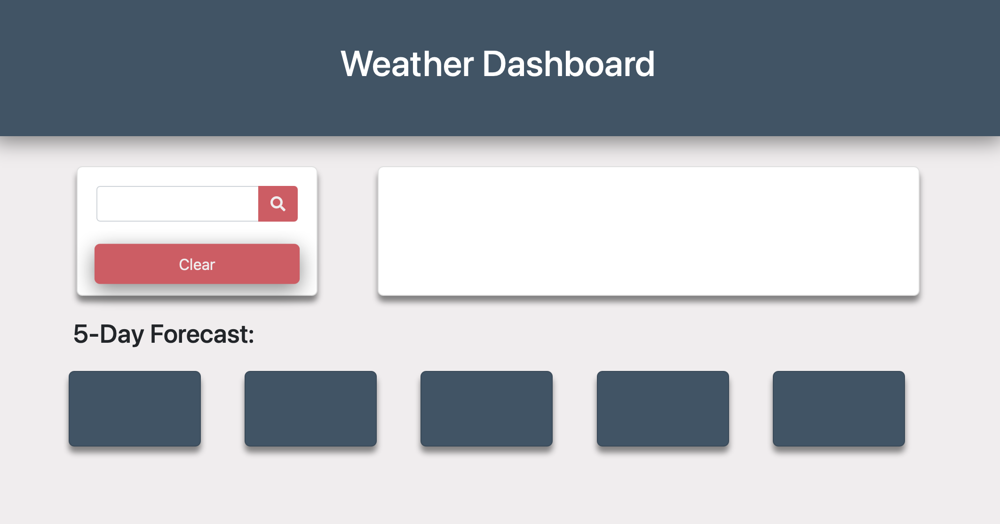

<!DOCTYPE html>
<html> 
      <head>
            <h2>Weather Dashboard</h2>
      </head>
      <body>
            <h5>Background</h5>
            <h6>Access project <a href="https://mcheering.github.io/Weather-Dashboard/">here</a></h6>
            
This project uses html, css, javascript/jQuery, and the openweather API to allow users to search cities and the dashboard return current weather along with a 5 day forecast.  The most challenging part of this project was to figure out how not to display duplicate cities.  AN early bug was a search for the same city would yield multiple recent search cards for that city.  However, this was fixed by using local storage and comparing strings to remove duplicates. Overall this project was a challenge to build

            <h5>Tutorial</h5>
            
The first time you land on the page, you will be greeted with blank cards like in the image below

            
            
Click into the search bar.  If you do not type a city and leave the search blank when you click the search button, you will receive an error message. 

            
            
After clearing the message, type in a valid city name, and click search and it will give you the current weather along with a 5 day forecast.

            
            
When you search you will see a bluish-green card display below the clear button.  For every unique city you search, a new card will display.  If you search same city twice, a new card will not pop up.

            
            
There is not a limit to how many cities you can add, but if you ever want to clear you search history, there is a button to clear everything.  This will also clear the cards on the page to get rid of the data being displayed.

            
            <h5>Potential Add-ons</h5>
            
In the future I could make it so that you can delete individual history items.  I would also like to find a way to pull images that are relatively current for a location so you can see what it looks like. 

      </body>
</html>